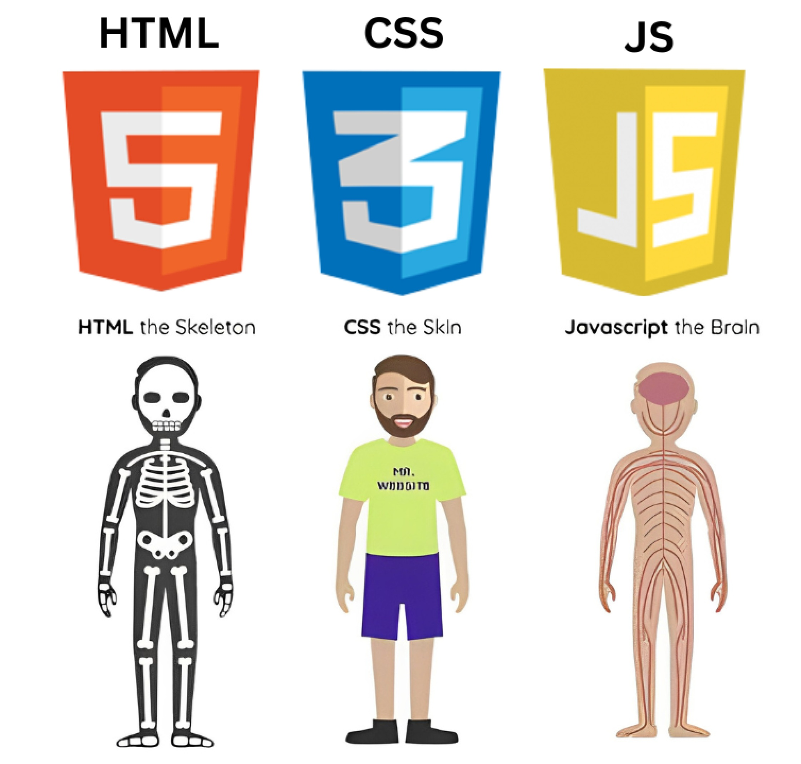
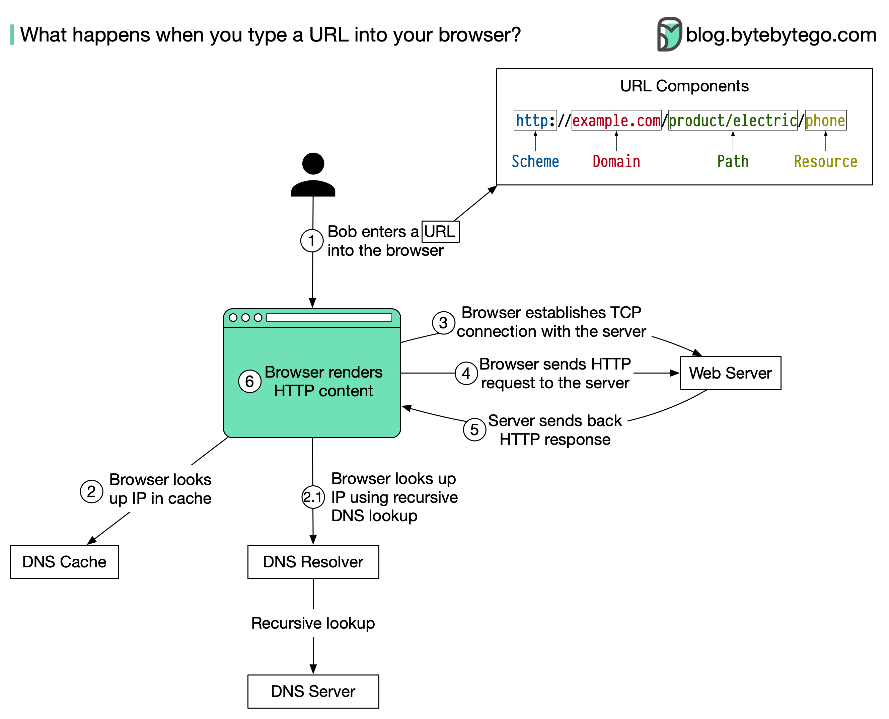
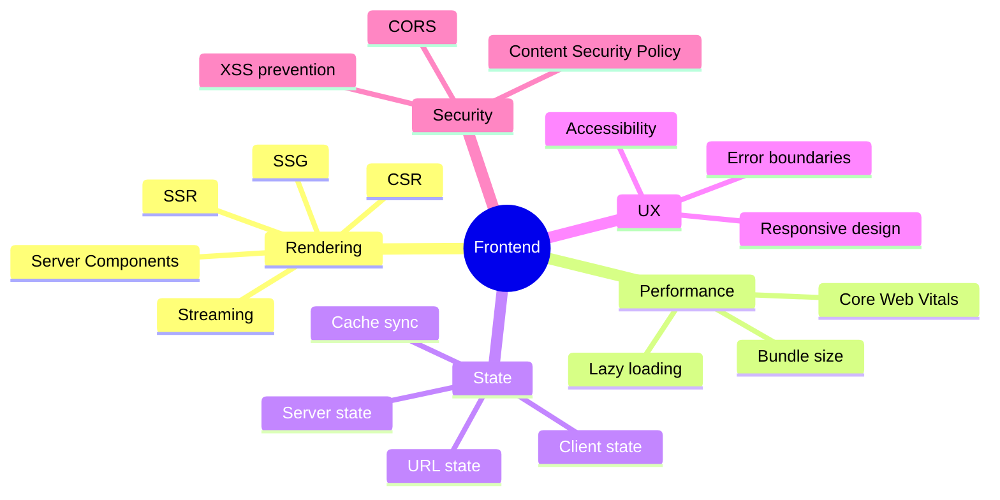

# how interactive websites actually work?

## 🌍Intro to the Web

- **Frontend**= what users see
- **Backend** = logic, database, server
  

> Frontend and backend work together to deliver a complete digital experience.

---

## 🎨 What Is Frontend?

Frontend is:

> The bridge between users and systems.

It transforms backend data into interactive, accessible, and user-friendly interfaces.
Frontend is responsible for:

- User Interface (UI)
- User Experience (UX)
- Interaction logic
- Client-side performance

---

## 🌐What Is a Browser?

A browser is the runtime environment for frontend code.

It:

- Sends requests to servers
- Receives responses
- Interprets HTML
- Applies CSS
- Executes JavaScript
- Renders the final page on screen

Frontend code lives and runs inside the browser.

---

## 🧱Core Technologies

- **HTML** → Structure
- **CSS** → Styling
- **JavaScript** → Logic

These are not **optional** they are fundamental.

---

## 🛠Tools, Frameworks & Libraries

Modern frontend goes beyond raw HTML/CSS/JS.

You must understand the difference between:

- **Language** → JavaScript
- **Library** → Helps solve specific problems
- **Framework** → Provides structure & architecture
- **Tools** → Improve development workflow

> Professional development requires mastering the ecosystem, not just syntax.

---

## 💼 Is That Enough to Get a Job?

No.

HTML, CSS, and JavaScript are only the foundation.

To become job-ready, you must also understand:

- Application architecture
- API communication
- Version control
- Performance optimization
- Deployment
- Problem solving

The journey doesn’t stop at the basics.

---

## 🌎 What Happens Behind the Scenes?

When you type a URL in the browser:

- DNS lookup resolves the domain
- A request is sent to the server
- The server processes it
- A response is returned
- The browser renders the page

> Understanding this flow separates beginners from engineers.

---

## ⚙ Rendering & Workflow

Rendering is the process of turning code into visual output.

- **HTML** → Parsed into the DOM
- **CSS** → Applied to style elements
- **JavaScript** → Adds interaction and dynamic behavior
- **Browser** → Renders the final UI

Modern applications can use:

- Client-Side Rendering (CSR)
- Server-Side Rendering (SSR)
- Static Generation (SSG)

Each has performance and SEO implications.

---

## 🧠 The Global Picture

Frontend is NOT:

- Just colors
- Just buttons
- Just animations

Frontend IS:

- Architecture
- Performance engineering
- Security awareness
- Backend communication
- Accessibility
- User-centered design

> Frontend development is engineering.

---

## 🔍 SEO Optimization

Search Engine Optimization matters because visibility matters.

Frontend impacts **SEO** through:

- Semantic HTML
- Page speed
- Accessibility
- Metadata
- Rendering strategy (CSR vs SSR)

---

## 🔗 Communication with Backend

Frontend applications communicate with backend systems using:

- APIs
- JSON
- HTTP requests (GET, POST, etc.)
- Authentication
- Authorization

> A real frontend developer must understand backend fundamentals to build complete systems.

## Roadmaps

Frontend Development Roadmap : https://roadmap.sh/frontend
